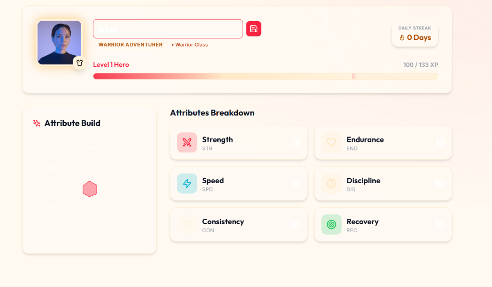
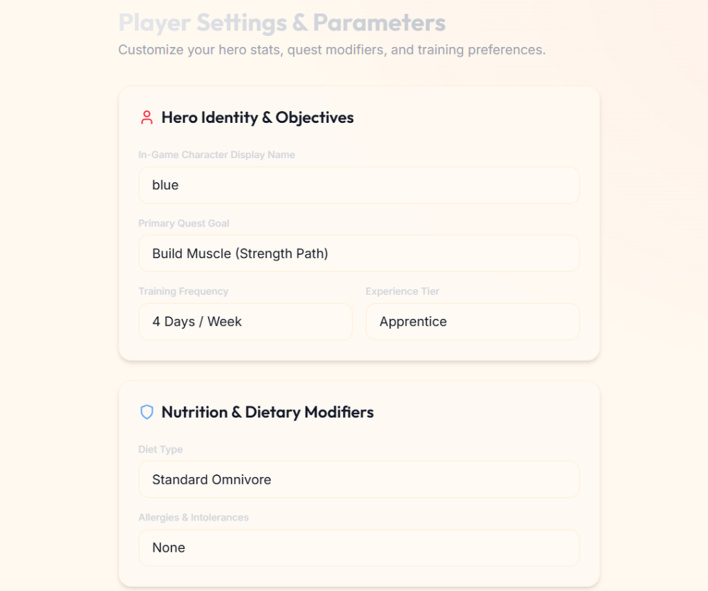
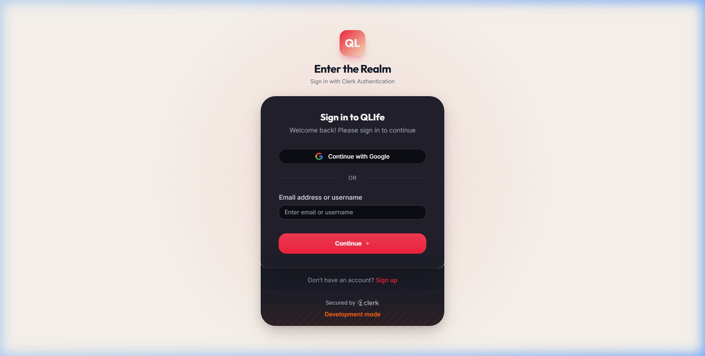

# ⚔️ QuestLife — Gamified RPG Fitness & Health Platform

[](https://quest-life-dun.vercel.app)
[](https://quest-life.onrender.com)
[](https://fastapi.tiangolo.com)
[](https://react.dev)
[](https://tailwindcss.com)
[](#-testing--quality-assurance)

**QuestLife** is an advanced RPG-inspired health and fitness platform that transforms daily workouts, nutrition tracking, and wellness habits into an immersive game experience. Level up your hero stats, complete daily and boss quests, earn XP, track macros, and climb global & guild leaderboards using real-time percentile rankings.

---

## 🌟 Screenshots & Interface Showcase

| 🛡️ Hero Profile & Stat Radar | ⚙️ Player Settings & Modifiers |
| :---: | :---: |
|  |  |

| 🔐 Modern Dark Theme Auth | 🚪 Authentication Gateway |
| :---: | :---: |
|  |  |

---

## ✨ Key Features

### ⚔️ 1. RPG Character & Progression System
- **Quadratic Level Scaling**: Real RPG curve where $\text{XP}_{\text{required}}(L) = 100 + 25L + 8L^2$.
- **6 Core Hero Attributes**:
  - **STR** (Strength) — Powered by resistance training & heavy compound lifts.
  - **END** (Endurance) — Built via cardio, running, and high-stamina sessions.
  - **SPD** (Speed) — Enhanced through tempo runs and agility drills.
  - **DIS** (Discipline) — Gained by maintaining daily log consistency.
  - **CON** (Consistency) — Levelled through active workout combo streaks.
  - **REC** (Recovery) — Improved via proper sleep, hydration, and healthy meals.
- **Hero Classes**: Paladin, Warrior, Ranger, Monk, and Mage with class affinity XP bonuses.

### 🎯 2. Quest Engine & Dynamic Rewards
- **Daily Quests**: Refreshes 5 targeted daily objectives every morning (e.g., *Morning Run*, *Hydration Target*, *Strength Training*).
- **Weekly & Boss Raids**: High-stakes challenges rewarding massive XP and achievement badges.
- **Automatic Progress Tracking**: Real-time progress updates whenever workouts, meals, or steps are logged.
- **Fair XP Distribution**: Exact matching between displayed card rewards and earned XP.

### 🏆 3. Decayed Power Score & Leaderboards
- **Fenwick Tree Engine**: Dynamic dynamic percentile ranking calculation for instant rank queries.
- **Time-Decayed Power Scores**: Rewards recent consistency while naturally decaying stale scores over time.
- **Global & Guild Leagues**: Streamlined **Global** and **Friends & Guild** leaderboards featuring Diamond, Gold, Silver, and Bronze league badges.

### 🥗 4. AI Nutrition & Macro Parser
- **Natural Language Meal Parser**: Analyzes meal entries like `"2 boiled eggs, 1 slice whole wheat toast, and 1 apple"` to extract calories, protein, carbs, fat, and fiber.
- **Allergen & Diet Filters**: Filters preset recipes based on user diet types (*Keto, Vegan, High-Protein*) and allergen exclusions (*Dairy, Nuts, Gluten*).
- **Resilient Local Fallback**: Built-in offline macro database ensuring zero UI crashes even if cloud servers cold-start.

### 🏋️ 5. Workout Planner & Movement Visualizer
- **Exercise Database & Keyframes**: Step-by-step form visuals for compound lifts, push/pull exercises, and core workouts.
- **Pose & Form Checker**: Computer vision form guidance for squat depth, bench bar path, and posture control.

---

## 🛠️ Architecture & Tech Stack

```
Quest-Life/
├── questlife-backend/        # FastAPI Python Backend
│   ├── app/
│   │   ├── engine/           # RPG progression, XP curves, Fenwick tree
│   │   ├── models/           # SQLAlchemy 2.0 async database schemas
│   │   ├── routers/          # REST API endpoints (/quests, /activities, /leaderboard)
│   │   ├── services/         # Nutrition DB, exercise DB, notification services
│   │   └── utils/            # Security, JWT, Fenwick algorithm
│   └── tests/                # 65 Pytest async test cases
└── questlife-frontend/       # React 18 + Vite 5 Single Page App
    ├── src/
    │   ├── api/              # API client wrapper with fallback handling
    │   ├── components/       # Glassmorphism UI components & modals
    │   ├── context/          # UserContext (Profile/Quests) & AuthContext (Clerk)
    │   ├── layouts/          # Responsive Dashboard layout with Sidebar & Header
    │   └── pages/            # Dashboard, Quests, Workout, Diet, Profile, Leaderboard, Settings
    └── vercel.json           # SPA rewrite configuration for Vercel deployment
```

### Stack Overview
- **Frontend**: React 18, Vite 5, Tailwind CSS, Lucide Icons, Recharts, Clerk React Authentication.
- **Backend**: Python 3.12+, FastAPI, SQLAlchemy 2.0 Async, Pydantic V2, Pytest (65 tests), SQLite / PostgreSQL.
- **Deployment**: Vercel (Frontend Static SPA) & Render (FastAPI Web Service).

---

## 🚀 Quick Start & Local Setup

### 1. Prerequisites
- **Node.js**: v18+ and `npm`
- **Python**: v3.12+ and `pip`

---

### 2. Backend Setup (`questlife-backend`)

```bash
# Navigate to backend directory
cd questlife-backend

# Create and activate virtual environment
python -m venv venv
# On Windows:
venv\Scripts\activate
# On macOS/Linux:
source venv/bin/activate

# Install dependencies
pip install -r requirements.txt

# Create environment configuration
cp .env.example .env

# Run the FastAPI development server
uvicorn app.main:app --reload --host 127.0.0.1 --port 8000
```
- **Swagger Documentation**: [http://127.0.0.1:8000/docs](http://127.0.0.1:8000/docs)
- **ReDoc**: [http://127.0.0.1:8000/redoc](http://127.0.0.1:8000/redoc)

---

### 3. Frontend Setup (`questlife-frontend`)

```bash
# Navigate to frontend directory
cd questlife-frontend

# Install node dependencies
npm install

# Create environment configuration
cp .env.example .env

# Start Vite development server
npm run dev
```
- **Web App**: [http://localhost:5173](http://localhost:5173)

---

## 🔑 Environment Variables

### Frontend `.env` (`questlife-frontend/.env`)
```env
VITE_CLERK_PUBLISHABLE_KEY=pk_test_YOUR_CLERK_KEY
VITE_API_BASE_URL=http://localhost:8000/api/v1
```

### Backend `.env` (`questlife-backend/.env`)
```env
PROJECT_NAME=Quest Life
DEBUG=true
DATABASE_URL=sqlite+aiosqlite:///./questlife.db
SECRET_KEY=your-secure-secret-key
CLERK_SECRET_KEY=sk_test_YOUR_CLERK_SECRET_KEY
```

---

## 🌐 Production Deployment

### ⚡ Deploying Frontend to Vercel
1. Link your GitHub repository to Vercel.
2. Set **Root Directory** to `questlife-frontend`.
3. Build Settings:
   - **Build Command**: `npm run build`
   - **Output Directory**: `dist`
4. Add Environment Variables:
   - `VITE_CLERK_PUBLISHABLE_KEY`
   - `VITE_API_BASE_URL`

### 🐍 Deploying Backend to Render
1. Create a new **Web Service** on Render linked to your repository.
2. Set **Root Directory** to `questlife-backend`.
3. Configure Commands:
   - **Build Command**: `pip install -r requirements.txt`
   - **Start Command**: `uvicorn app.main:app --host 0.0.0.0 --port $PORT`

---

## 🧪 Testing & Quality Assurance

Run the comprehensive pytest backend test suite:

```bash
cd questlife-backend
py -3 -m pytest
```

```text
============================= test session starts =============================
collected 65 items

tests/test_activities.py ......                                          [ 9%]
tests/test_auth.py ............                                          [27%]
tests/test_class_system.py ....                                          [33%]
tests/test_fenwick.py ..                                                 [36%]
tests/test_leaderboard_service.py ...                                    [41%]
tests/test_nutrition.py ....s                                            [49%]
tests/test_phase3.py .....                                               [56%]
tests/test_phase4.py ......                                              [66%]
tests/test_planners.py ...                                               [70%]
tests/test_stats_engine.py .....                                         [78%]
tests/test_streak_engine.py ....                                         [84%]
tests/test_xp_engine.py ..........                                       [100%]

================== 64 passed, 1 skipped in 58.90s ===================
```

---

## 📄 License

Distributed under the MIT License. See [LICENSE](LICENSE) for details.
